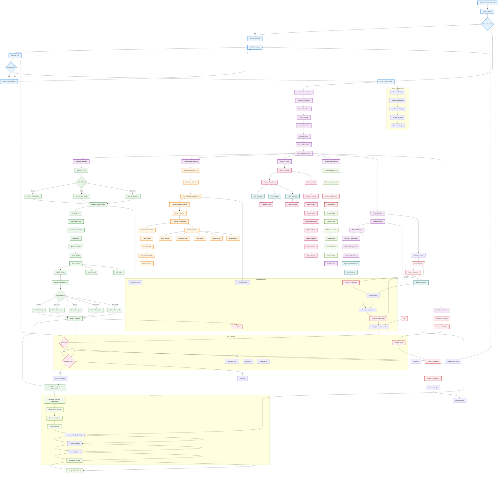

# Admin Dashboard Flow - Current System

## Admin Dashboard Flow Description

### 1. **Admin Authentication**
- **Login Required**: Admin access protected by authentication
- **Credential Validation**: Secure login process with error handling
- **Session Management**: Maintains admin session
- **Access Control**: Only authenticated users can access dashboard

### 2. **Dashboard Overview**
- **Quick Stats**: Real-time display of key metrics
- **Order Metrics**: Total orders, revenue, active customers
- **Recent Orders**: List of recent orders with status
- **Navigation**: Clear menu structure for all admin functions

### 3. **Order Management**
- **Order Listing**: Comprehensive order list with filtering options
- **Status Filtering**: Filter orders by status, date, customer
- **Order Details**: Detailed view of order information
- **Status Updates**: Change order status with database updates
- **Real-time Updates**: Order status updates in real-time

### 4. **Customer Management**
- **Customer Search**: Search customers by WhatsApp or name
- **Customer Details**: Complete customer information display
- **Order History**: Customer's complete order history
- **Financial Data**: Total spending and payment information
- **Referral Integration**: Referral and points information

### 5. **Service Catalog Management**
- **Category Management**: Add, edit, delete service categories
- **Service Creation**: Create new services with details
- **Price Management**: Set service pricing
- **Image Upload**: Add service images
- **Real-time Updates**: Catalog updates immediately

### 6. **Discount Management**
- **Discount Codes**: Create and manage discount codes
- **Discount Types**: Various discount types and amounts
- **Usage Limits**: Set usage restrictions and dates
- **Active Status**: Enable/disable discounts
- **Performance Tracking**: Track discount usage analytics

### 7. **Referral System Administration**
- **Settings Configuration**: Configure referral system parameters
- **Discount Settings**: Set referral discount amounts
- **Points Configuration**: Configure points earning rules
- **System Control**: Enable/disable referral system
- **Analytics Dashboard**: Track referral performance

### 8. **Customer Points Management**
- **Customer Points List**: View all customers with points
- **Balance Management**: Adjust customer point balances
- **Transaction History**: Complete points transaction records
- **Manual Adjustments**: Add or deduct points manually
    - **Reason Tracking**: Record reasons for point adjustments

### 9. **Analytics and Reports**
- **Revenue Analytics**: Financial performance tracking
- **Order Statistics**: Order completion metrics
- **Customer Analytics**: Customer behavior insights
- **Service Performance**: Service usage analytics
- **Report Export**: Generate and export various reports

### 10. **Real-time Features**
- **Live Updates**: Dashboard updates in real-time
- **Status Notifications**: Instant notifications for changes
    - **Customer Updates**: Customer information changes
    - **Order Changes**: Order status updates
    - **System Changes**: Configuration updates
- **WebSocket-like Updates**: Supabase real-time subscriptions

### 11. **Database Operations**
- **Orders Table**: Order records and status tracking
- **Customers Table**: Customer information management
- **Services Table**: Service catalog data
- **Discounts Table**: Discount code management
- **Referral Tables**: Referral system data
- **Points Tables**: Points system records

### 12. **Error Handling**
- **Authentication Errors**: Login and session errors
- **Database Errors**: Database operation failures
- **Validation Errors**: Input validation failures
- **API Errors**: Service communication errors
- **Network Errors**: Connection and timeout errors

## Key Technical Components

### Frontend Components
- **Dashboard Layout**: Main dashboard interface
- **Order Components**: Order management interfaces
- **Customer Components**: Customer management tools
- **Settings Forms**: Configuration interfaces
- **Analytics Charts**: Data visualization components

### State Management
- **Real-time Subscriptions**: Live data updates
- **Admin State**: Dashboard state management
- **Form State**: Form data management
- **Cache Management**: Data caching for performance

### API Integration
- **Order APIs**: Order management endpoints
- **Customer APIs**: Customer management endpoints
    - **Referral APIs**: Referral system endpoints
    - **Points APIs**: Points management endpoints
    - **Analytics APIs**: Reporting endpoints

### Database Integration
- **Real-time Subscriptions**: Supabase real-time
- **CRUD Operations**: Complete database operations
- **Data Validation**: Input validation and sanitization
- **Relationships**: Proper foreign key relationships

### Security Features
- **Authentication**: Secure admin login system
- **Authorization**: Role-based access control
- **Data Validation**: Input validation and sanitization
- **Audit Trail**: Complete logging of admin actions

This flowchart represents the actual admin dashboard system implemented in the codebase, showing how administrators can manage all aspects of the shoe cleaning service business through a comprehensive, real-time dashboard interface.