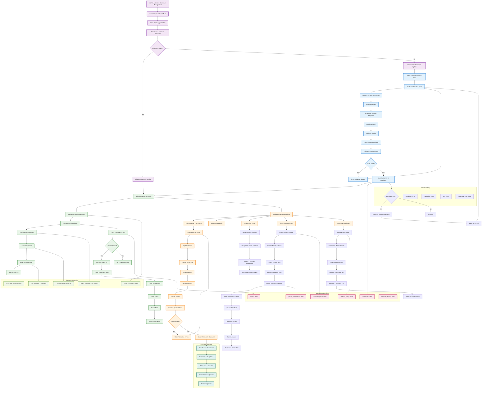

# Customer Management Flow - Current System

## Customer Management Flow Description

### 1. **Customer Search & Selection**
- **WhatsApp Search**: Primary method for finding existing customers
- **Database Query**: Searches customers table by WhatsApp number
- **Customer Display**: Shows detailed customer information when found
- **New Customer Option**: Provides option to create new customer if not found

### 2. **New Customer Creation**
- **Required Fields**: Name and WhatsApp number are mandatory
- **Optional Fields**: Email, address, and additional phone numbers
- **Data Validation**: Real-time validation of customer information
- **Database Insert**: New customer records are saved to customers table

### 3. **Customer Information Display**
- **Profile Summary**: Complete customer profile with all details
- **Order History**: List of all customer orders with status
- **Financial Summary**: Total spending and order statistics
- **System Integration**: Shows referral and points information

### 4. **Customer Order History**
- **Order List**: Chronological list of customer orders
- **Order Details**: Detailed view of each order
- **Status Tracking**: Current status of each order
- **Financial Data**: Order totals and payment information

### 5. **Customer Actions**
- **Edit Information**: Update customer details
- **View Orders**: Access detailed order information
- **New Order**: Start new order with pre-filled customer data
- **Points Management**: View points balance and history
- **Referral Info**: Access referral system information

### 6. **Points System Integration**
- **Balance Display**: Current points balance
- **Transaction History**: Complete record of points transactions
- **Points Details**: Transaction types, amounts, and references
- **Real-time Updates**: Points balance updates automatically

### 7. **Referral System**
- **Referral Code**: Customer's unique referral code
- **Referral Statistics**: Total referrals and bonuses earned
- **Referred Customers**: List of customers referred
- **Usage History**: Track of referral code usage

### 8. **Real-time Features**
- **Live Updates**: Customer information updates in real-time
- **Database Sync**: Automatic synchronization with database
- **Status Changes**: Instant status updates
- **Error Handling**: Graceful handling of sync errors

## Key Technical Components

### Frontend Components
- **Customer Management Interface**: Search and display components
- **Customer Forms**: Creation and editing forms
- **Order History Components**: Display customer orders
- **Points Display**: Points balance and history components
- **Referral Components**: Referral information display

### State Management
- **customerStore.ts**: Customer data management
- **orderStore.ts**: Customer order history
- **Real-time Subscriptions**: Live data updates
- **Form State**: Customer form state management

### API Integration
- **Customer APIs**: CRUD operations for customers
- **Order APIs**: Customer order data
- **Points APIs**: Points balance and history
- **Referral APIs**: Referral information access

### Database Schema
- **customers table**: Customer personal information
- **orders table**: Customer order records
- **customer_points table**: Points balance tracking
- **points_transactions table**: Points transaction history
- **referral_usage table**: Referral system data

### Real-time Features
- **Supabase Subscriptions**: Live data updates
- **Automatic Refresh**: Customer data updates automatically
- **Status Notifications**: Real-time status changes
- **Error Recovery**: Handles connection issues gracefully

This flowchart represents the actual customer management system implemented in the codebase, showing how customers are created, managed, and integrated with the order, points, and referral systems.