# Order Processing Flow - Current System

```mermaid
graph TD
    %% Customer Selection & Creation
    A[Admin Starts New Order] --> B{Customer Search by WhatsApp}
    B -->|Found| C[Select Existing Customer]
    B -->|Not Found| D[Create New Customer]
    D --> E[Enter Customer Details]
    E --> F[WhatsApp, Email, Name, Address]
    F --> G[Save Customer to Database]
    G --> H[Set as Active Customer]

    %% Shoe Service Selection
    C --> I[Service Selection Screen]
    H --> I
    I --> J[Select Shoe Services]
    J --> K{Add Multiple Services per Shoe?}
    K -->|Yes| L[Add Services via Services Component]
    K -->|No| M[Single Service Selection]
    L --> N[Services Added to Cart]
    M --> N

    %% Cart Management
    N --> O[Review Order Cart]
    O --> P{Customer Has Referral Code?}
    P -->|No| Q[Continue to Payment Selection]
    P -->|Yes| R[Enter Referral Code]
    R --> S[Validate Referral Code]
    S --> T{Code Valid?}
    T -->|No| U[Show Invalid Code Error]
    U --> R
    T -->|Yes| V[Apply Referral Discount]

    %% Points System Integration
    V --> W[Check Customer Points Balance]
    Q --> W
    W --> X[Display Available Points]
    X --> Y{Customer Wants to Use Points?}
    Y -->|No| Z[Proceed with Referral Discount Only]
    Y -->|Yes| AA[Enter Points to Redeem]
    AA --> BB[Validate Points Available]
    BB --> CC{Points Valid?}
    CC -->|No| DD[Show Insufficient Points Error]
    DD --> AA
    CC -->|Yes| EE[Apply Points Discount]

    %% Order Summary & Calculation
    Z --> FF[Calculate Order Total]
    EE --> FF
    FF --> GG[Apply Service Charges]
    GG --> HH[Apply Referral Discount]
    HH --> II[Apply Points Discount]
    II --> JJ[Calculate Final Total]
    JJ --> KK[Display Order Summary]
    KK --> LL{Customer Confirms Order?}
    LL -->|No| MM[Back to Edit Order]
    LL -->|Yes| NN[Proceed to Payment]

    %% Payment Processing
    NN --> OO[Select Payment Method]
    OO --> PP{Payment Type?}
    PP -->|QRIS| QQ[Generate QRIS Payment]
    PP -->|Cash| RR[Mark as Cash Payment]
    PP -->|Other| SS[Record Payment Method]
    QQ --> TT[Display QR Code]
    TT --> UU[Wait for Payment Confirmation]
    UU --> VV{Payment Confirmed?}
    VV -->|No| WW[Payment Timeout/Error]
    WW --> OO
    VV -->|Yes| XX[Payment Completed]

    %% Order Creation & Processing
    XX --> YY[Create Order Record]
    YY --> ZZ[Insert Order Items]
    ZZ --> AAA[Insert Order Discounts]
    AAA --> BBB[Update Order Status]
    BBB --> CCC[Process Referral System]
    CCC --> DDD[Process Points System]
    DDD --> EEE[Generate Receipt]
    EEE --> FFF[Send Order Confirmation]

    %% Backend Processing Details
    subgraph "Backend Processing"
        GG1[Validate Order Data]
        HH1[Insert into orders table]
        II1[Insert into order_item table]
        JJ1[Insert into order_discounts table]
        KK1[Update customer status]
        LL1[Trigger real-time updates]
    end

    YY --> GG1
    GG1 --> HH1
    HH1 --> II1
    II1 --> JJ1
    JJ1 --> KK1
    KK1 --> LL1

    %% Error Handling
    subgraph "Error Handling"
        NN1[Customer Creation Error]
        OO1[Service Selection Error]
        PP1[Payment Processing Error]
        QQ1[Database Error]
        RR1[Referral System Error]
        SS1[Points System Error]
    end

    G --> NN1{Customer Error?}
    NN1 -->|Yes| TT1[Log Error & Show Message]
    NN1 -->|No| UU1[Success]
    TT1 --> D

    %% Real-time Updates
    subgraph "Real-time Features"
        VV1[Supabase Real-time Subscriptions]
        WW1[Order Status Updates]
        XX1[Customer List Updates]
        YY1[Service Catalog Updates]
        ZZ1[Real-time Dashboard]
    end

    LL1 --> VV1
    VV1 --> WW1
    WW1 --> XX1
    XX1 --> YY1
    YY1 --> ZZ1

    %% Styling
    classDef customer fill:#e3f2fd,stroke:#1976d2,stroke-width:2px
    classDef service fill:#f3e5f5,stroke:#7b1fa2,stroke-width:2px
    classDef payment fill:#e8f5e8,stroke:#388e3c,stroke-width:2px
    classDef validation fill:#fff3e0,stroke:#f57c00,stroke-width:2px
    classDef processing fill:#fce4ec,stroke:#c2185b,stroke-width:2px
    classDef database fill:#f1f8e9,stroke:#689f38,stroke-width:2px
    classDef realtime fill:#e0f2f1,stroke:#00695c,stroke-width:2px

    class A,B,C,D,E,F,G,H customer
    class I,J,K,L,M,N service
    class O,P,Q,R,S,T,U,V,W,X,Y,Z,AA,BB,CC,DD,EE,FF,GG,HH,II,JJ,KK,LL,MM,NN,OO,PP,QQ,RR,SS,TT,UU,VV,WW,XX payment
    class S,T,BB,CC validation
    class YY,ZZ,AAA,BBB,CCC,DDD,EEE,FFF processing
    class GG1,HH1,II1,JJ1,KK1,LL1 database
    class VV1,WW1,XX1,YY1,ZZ1 realtime
```

## Order Processing Flow Description

### 1. **Customer Management**
- **Customer Search**: Admin searches for existing customers by WhatsApp number
- **Customer Creation**: New customers are added with complete details (WhatsApp, email, name, address)
- **Customer Selection**: Existing customers can be selected from search results
- **Customer Status**: Customer becomes active for the current order

### 2. **Service Selection**
- **Service Catalog**: Admin selects from available shoe cleaning services
- **Multiple Services**: Each shoe item can have multiple services added
- **Service Management**: Services are managed through the Services.tsx component
- **Cart Building**: Selected services are added to the order cart

### 3. **Referral System Integration**
- **Code Entry**: Customer can enter referral code for discounts
- **Code Validation**: System validates code through `/api/referral/validate`
- **Discount Application**: Valid codes apply referral discounts automatically
- **Error Handling**: Invalid codes show helpful error messages

### 4. **Points System**
- **Balance Check**: Customer's current points balance is displayed
- **Points Redemption**: Customers can choose to redeem points for discounts
- **Validation**: System ensures sufficient points are available
- **Deduction**: Points are deducted when order is completed

### 5. **Order Summary**
- **Cost Calculation**: Total cost includes all services and discounts
- **Discount Application**: Both referral and points discounts are applied
- **Final Total**: Customer sees the final amount to pay
- **Order Confirmation**: Customer confirms the order details

### 6. **Payment Processing**
- **Payment Methods**: QRIS, cash, and other payment options
- **QRIS Generation**: Dynamic QR code generation for digital payments
- **Payment Confirmation**: System waits for payment confirmation
- **Error Recovery**: Payment errors are handled gracefully

### 7. **Backend Processing**
- **Order Creation**: Complete order record is created in database
- **Item Management**: All order items are properly recorded
- **Discount Tracking**: Applied discounts are saved for reference
- **Status Updates**: Order status is tracked throughout processing

### 8. **Real-time Features**
- **Live Updates**: Supabase real-time subscriptions provide instant updates
- **Status Tracking**: Order progress is updated in real-time
- **Dashboard Updates**: Admin dashboard reflects changes immediately
- **Customer Notifications**: System provides real-time feedback

## Key Technical Components

### Frontend Components
- **OrderApp.tsx**: Main order processing interface
- **Services.tsx**: Service selection and management
- **Cart Components**: Cart management and display
- **Payment Components**: Payment processing interfaces
- **Customer Components**: Customer management forms

### State Management
- **orderStore.ts**: Order state management
- **customerStore.ts**: Customer data management
- **cartStore.ts**: Shopping cart functionality
- **serviceCatalogStore.ts**: Service catalog management

### API Integration
- **Referral APIs**: Code validation and tracking
- **Points APIs**: Balance checking and redemption
- **Order APIs**: Order creation and management
- **Customer APIs**: Customer management operations

### Database Operations
- **orders table**: Main order records
- **order_item table**: Individual service items
- **order_discounts table**: Applied discounts
- **customers table**: Customer information
- **referral_tracking**: Referral system data
- **points_transactions**: Points system records

This flowchart represents the actual implemented order processing system in the codebase, showing all the major components and their interactions.