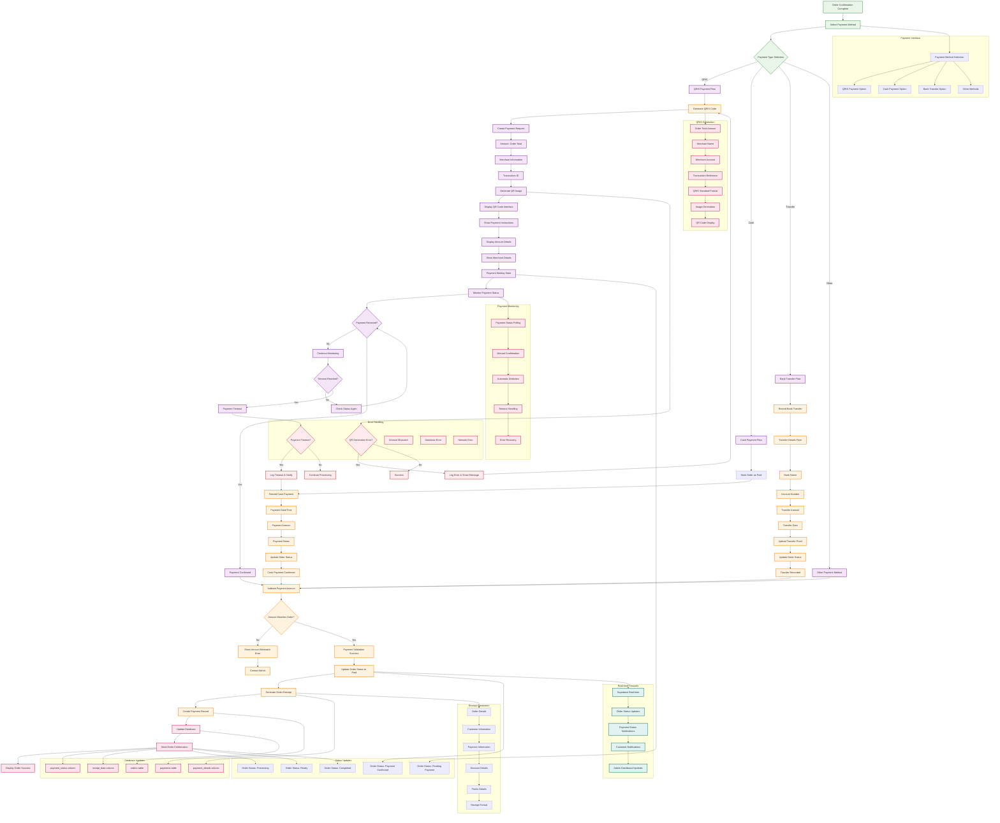

# Payment & QRIS Flow - Current System

## Payment & QRIS Flow Description

### 1. **Payment Method Selection**
- **Multiple Options**: QRIS, Cash, Bank Transfer, and Other payment methods
- **Order Context**: Payment selection happens after order confirmation
- **Method Validation**: Each payment type has specific validation rules
- **User Interface**: Clear payment method selection interface

### 2. **QRIS Payment Process**
- **Dynamic Generation**: QR codes are generated for each specific order
- **Order Integration**: QR codes contain order-specific information
- **Amount Display**: Clear display of payment amount
- **Merchant Information**: Business details included in QR code

### 3. **QRIS Code Generation**
- **Order Total**: Exact order amount
- **Merchant Details**: Business name and account information
- **Transaction Reference**: Unique identifier for each payment
- **Standard Compliance**: Follows QRIS standard format
- **Image Generation**: Creates scannable QR code image

### 4. **Payment Monitoring**
- **Status Tracking**: Continuous monitoring of payment status
- **Timeout Handling**: Automatic timeout for unconfirmed payments
- **Manual Confirmation**: Admin can manually confirm payments
- **Error Recovery**: Handles payment errors gracefully

### 5. **Alternative Payment Methods**
- **Cash Payments**: Manual recording of cash transactions
- **Bank Transfers**: Support for bank transfer with proof upload
- **Other Methods**: Flexible payment method recording
- **Validation**: Amount validation for all payment types

### 6. **Payment Confirmation**
- **Amount Validation**: Confirms payment amount matches order total
- **Status Updates**: Updates order status to paid
- **Receipt Generation**: Creates payment receipt
- **Database Updates**: Records payment information in database

### 7. **Order Completion**
- **Status Progression**: Order moves through completion stages
- **Receipt Generation**: Detailed receipt with all payment information
- **Customer Notification**: Order confirmation sent to customer
- **Admin Notification**: Payment confirmation for admin records

### 8. **Real-time Updates**
- **Live Status**: Payment status updates in real-time
- **Dashboard Updates**: Admin dashboard reflects changes immediately
- **Customer Notifications**: Real-time payment confirmations
- **Error Handling**: Graceful handling of connection issues

## Key Technical Components

### Frontend Components
- **Payment Selection**: Payment method selection interface
- **QRIS Display**: QR code generation and display
- **Payment Monitoring**: Payment status tracking interface
- **Receipt Generation**: Receipt creation and display

### QRIS Generation
- **Order Integration**: QR codes linked to specific orders
- **Amount Validation**: Ensures correct payment amounts
- **Standard Compliance**: Follows QRIS technical standards
- **Image Generation**: High-quality QR code image creation

### Database Operations
- **Payment Records**: Complete payment transaction logging
- **Order Status**: Payment status updates in orders table
- **Receipt Data**: Receipt information storage
- **Transaction History**: Complete payment audit trail

### Real-time Features
- **Supabase Subscriptions**: Live payment status updates
- **Status Notifications**: Instant payment confirmations
- **Dashboard Integration**: Real-time admin updates
- **Error Recovery**: Handles connection issues automatically

### Security Features
- **Transaction Validation**: Verifies payment amounts
- **Reference Tracking**: Unique transaction identifiers
- **Audit Trail**: Complete payment history logging
- **Data Integrity**: Ensures payment data consistency

This flowchart represents the actual payment and QRIS system implemented in the codebase, showing how payments are processed, monitored, and confirmed through the various payment methods available in the system.