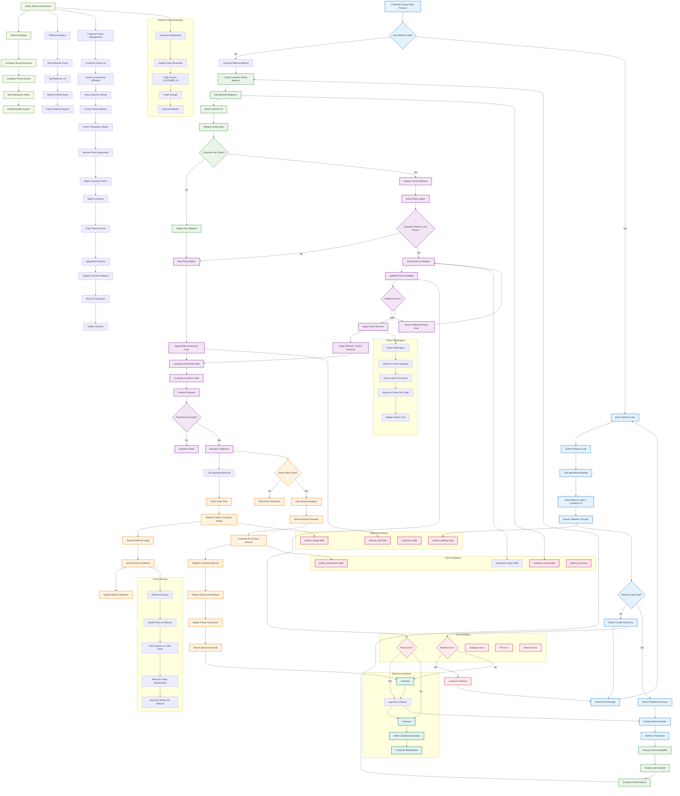

# Referral & Points System Flow - Current Implementation

## Referral & Points System Flow Description

### 1. **Referral Code Entry & Validation**
- **Code Entry**: Customers can enter referral codes during order process
- **API Validation**: Codes are validated through `/api/referral/validate`
- **Error Handling**: Invalid codes show helpful error messages
- **Success Response**: Valid codes return referrer details and discount info

### 2. **Referral Discount Application**
- **Discount Amount**: Automatically applies configured discount
- **Referrer Info**: Displays referrer information
- **Points Award**: Shows points that will be awarded to referrer
- **Order Integration**: Seamlessly integrated into order flow

### 3. **Points Balance Management**
- **Balance Check**: Current points balance retrieved via `/api/points/balance`
- **Display Options**: Shows current balance when available
- **Zero Balance**: Handles customers with no points gracefully
- **Real-time Updates**: Balance updates in real-time

### 4. **Points Redemption**
- **Points Entry**: Customers can specify points to redeem
- **Validation**: System validates sufficient points availability
- **Discount Application**: Points converted to order discount
- **Rules Enforcement**: Follows redemption rules and limits

### 5. **Order Processing Integration**
- **Combined Discounts**: Both referral and points discounts can be applied
- **Final Calculation**: Accurate total calculation with all discounts
- **Payment Processing**: Normal payment flow continues
- **Order Confirmation**: Standard order confirmation process

### 6. **Referral Recording**
- **API Call**: Referral usage recorded via `/api/referral/record`
- **Database Update**: Referral usage saved to database
- **Points Awarding**: Referrer automatically receives points
- **Statistics Update**: Referral performance metrics updated

### 7. **Points Deduction**
- **Deduction API**: Points deducted via `/api/points/deduct`
- **Balance Validation**: Ensures sufficient points before deduction
- **Transaction Record**: Points transactions recorded
- **Real-time Updates**: Balance updates immediately

### 8. **Admin Management**
- **Settings Configuration**: Admin can configure system parameters
- **Customer Management**: View and adjust customer points
- **Analytics Dashboard**: Track referral performance
- **Manual Adjustments**: Admin can manually adjust points

### 9. **Referral Analytics**
- **Total Referrals**: Count of successful referrals
- **Top Referrers**: List of most successful referrers
- **Performance Metrics**: Detailed referral statistics
- **Export Reports**: Generate and export referral reports

### 10. **Customer Points Management**
- **Customer Search**: Find customers by ID or name
- **Balance Display**: Current points balance for each customer
- **Transaction History**: Complete points transaction history
- **Manual Adjustments**: Admin can add or subtract points

### 11. **Real-time Features**
- **Live Updates**: Points balance updates in real-time
- **Status Notifications**: Instant referral status updates
- **Dashboard Sync**: Admin dashboard updates immediately
- **Customer Notifications**: Real-time notifications to customers

## Key Technical Components

### Frontend Components
- **Referral Input**: Referral code entry and validation
- **Points Display**: Points balance and redemption interface
- **Admin Dashboard**: Complete referral and points management
- **Analytics Charts**: Visual representation of referral data

### API Endpoints
- **`/api/referral/validate`**: Referral code validation
- **`/api/referral/record`**: Referral usage recording
- **`/api/points/balance`**: Points balance retrieval
- **`/api/points/deduct`**: Points deduction

### Database Schema
- **referral_settings**: System configuration
- **referral_usage**: Referral tracking
- **customer_points**: Points balance management
- **points_transactions**: Transaction history

### State Management
- **Real-time Subscriptions**: Live data updates
- **Form State**: Referral and points form management
- **Admin State**: Dashboard state management

### Security Features
- **Code Validation**: Secure referral code validation
- **Transaction Safety**: Atomic points operations
- **Audit Trail**: Complete transaction logging
- **Rate Limiting**: Prevents abuse of system

This flowchart represents the actual referral and points system implemented in the codebase, showing how customers can use referral codes and points, and how admins manage the complete system through the dashboard interface.