# Referral System Flow - Current Implementation

```mermaid
graph TD
    %% Referral Code Entry
    A[Customer During Order] --> B{Has Referral Code?}
    B -->|No| C[Continue Normal Order]
    B -->|Yes| D[Enter Referral Code]
    D --> E[Submit Code for Validation]

    %% API Validation
    E --> F[POST /api/referral/validate]
    F --> G[Send: referral_code, customer_id]
    G --> H[Server Validation Process]
    H --> I{Code Valid & Active?}
    I -->|No| J[Return Error Response]
    I -->|Yes| K[Return Success Response]

    %% Response Handling
    J --> L[Display: Invalid Code Error]
    L --> M[Remove Code from Form]
    M --> N[Continue Order Without Discount]
    K --> O[Display Referral Success]
    O --> P[Show Referrer Information]
    P --> Q[Apply Referral Discount]

    %% Discount Application
    Q --> R[Apply Discount to Order Total]
    R --> S[Update Order Summary]
    S --> T[Display Discount Applied Message]
    T --> U[Continue to Points Check]

    %% Points Balance Check (Optional)
    C --> V[Check Customer Points]
    U --> V
    V --> W[GET /api/points/balance]
    W --> X[Send: customer_id]
    X --> Y[Retrieve Points Balance]
    Y --> Z{Customer Has Points?}
    Z -->|No| AA[Show: No Points Available]
    Z -->|Yes| BB[Show Current Balance]
    AA --> CC[Skip Points Option]
    BB --> DD[Offer Points Redemption]

    %% Points Redemption Decision
    DD --> EE{Customer Wants to Use Points?}
    EE -->|No| FF[Continue with Referral Discount Only]
    EE -->|Yes| GG[Enter Points Amount]
    GG --> HH[Validate Points Available]
    HH --> II{Sufficient Points Available?}
    II -->|No| JJ[Show: Insufficient Points Error]
    JJ --> GG
    II -->|Yes| KK[Apply Points Discount]

    %% Order Finalization
    FF --> LL[Calculate Final Total]
    KK --> LL
    LL --> MM[Show Order Summary]
    MM --> NN{Customer Confirms Order?}
    NN -->|No| OO[Back to Edit Order]
    NN -->|Yes| PP[Process Payment]

    %% Payment Success
    PP --> QQ{Payment Successful?}
    QQ -->|No| RR[Payment Failed - Retry]
    QQ -->|Yes| SS[Payment Confirmed]

    %% Referral Recording (Backend)
    SS --> TT[POST /api/referral/record]
    TT --> UU[Send: order_data]
    UU --> VV[Referral Code & Customer IDs]
    VV --> WW[Record Referral Usage]
    WW --> XX[Update referral_usage Table]

    %% Referrer Points Awarding
    XX --> YY[Check Referrer Points Config]
    YY --> ZZ[Get Points Amount from Settings]
    ZZ --> AAA[Update Referrer Balance]
    AAA --> BBB[Add Points Transaction]
    BBB --> CCC[Update customer_points Table]
    CCC --> DDD[Update points_transactions Table]

    %% Customer Points Deduction (If Used)
    SS --> EE{Points Were Used?}
    EE -->|No| FF[Skip Points Deduction]
    EE -->|Yes| GG[POST /api/points/deduct]
    GG --> HH[Send: customer_id, points_used]
    HH --> II[Validate Customer Balance]
    II --> JJ[Deduct Points from Balance]
    JJ --> KK[Update customer_points Table]
    KK --> LL[Create Points Transaction]
    LL --> MM[Update points_transactions Table]

    %% Database Tables Structure
    subgraph "Database Schema"
        NNN[referral_settings table]
        OOO[referral_usage table]
        PPP[customers table]
        QQQ[customer_points table]
        RRR[points_transactions table]
        SSS[orders table]
        TTT[order_discounts table]
    end

    WW --> OOO
    CCC --> QQQ
    BBB --> QQQ
    CCC --> RRR
    LL --> RRR
    UU --> SSS
    UU --> TTT

    %% Admin Referral Management
    UUU[Admin Dashboard] --> VVV[Referral Settings]
    VVV --> WWW[Discount Amount Configuration]
    WWW --> XXX[Points Earned per Referral]
    XXX --> YYY[Points Redemption Rules]
    YYY --> ZZZ[Minimum Points Required]
    ZZZ --> AAAA[Points Value Conversion]
    AAAA --> BBBB[System Enable/Disable]
    BBBB --> CCCC[Save Settings]

    %% Referral Analytics
    VVV --> DDDD[Referral Analytics]
    DDDD --> EEEE[Total Referrals Count]
    EEEE --> FFFF[Successful Referrals]
    FFFF --> GGGG[Referral Usage Chart]
    GGGG --> HHHH[Top Referrers List]
    HHHH --> IIII[Referral Performance]
    IIII --> JJJJ[Export CSV Reports]

    %% Customer Referral History
    KKK[Customer Portal] --> LLL[My Referrals]
    LLL --> MMM[Referral Code Display]
    MMM --> NNN[Total Referrals Made]
    NNN --> OOO[Points Earned from Referrals]
    OOO --> PPP[Referral History Timeline]

    %% Real-time Updates
    subgraph "Real-time Features"
        QQQQ[Supabase Real-time Subscriptions]
        RRRR[Referral Status Updates]
        SSSS[Points Balance Updates]
        TTTT[Dashboard Live Updates]
        UUUU[Customer Notifications]
    end

    WW --> QQQQ
    QQQQ --> RRRR
    CCC --> SSSS
    TTTT --> UUUU

    %% Error Handling
    subgraph "Error Handling"
        VVVVV[Invalid Referral Code]
        WWWWW[Referral Already Used]
        XXXXX[Self-Referral Prevention]
        YYYY[Database Connection Error]
        ZZZZZ[Points System Error]
    end

    H --> VVVVV{Referral Error?}
    VVVVV -->|Yes| WWWWW[Log Error]
    WWWWW --> L
    VVVVV -->|No| XXXXX[Continue]

    %% Referral Code Generation (For New Customers)
    subgraph "Referral Code Generation"
        AAAAAA[Customer Registration]
        BBBBBB[Generate Unique Code]
        CCCCCC[Code Format: CUSTOMER_ID]
        DDDDDD[Store in Database]
        EEEEE[Share with Customer]
    end

    KKK --> AAAAAA
    AAAAAA --> BBBBBB
    BBBBBB --> CCCCCC
    CCCCCC --> DDDDD
    DDDDD --> EEEEE

    %% Referral Validation Rules
    subgraph "Validation Rules"
        FFFFF[Code Exists in Database]
        GGGGG[Code is Active]
        HHHHH[Not Self-Referral]
        IIIII[Not Previously Used by Customer]
        JJJJJ[Referrer Account is Active]
    end

    H --> FFFFF
    FFFFF --> GGGGG
    GGGGG --> HHHHH
    HHHHH --> IIIII
    IIIII --> JJJJJ

    %% Points Earning Rules
    subgraph "Points Earning"
        KKKKK[Successful Referral]
        LLLLL[Points Awarded to Referrer]
        MMMMM[Points Amount from Settings]
        NNNNN[Transaction Created]
        OOOOO[Referrer Notified]
    end

    XX --> KKKKK
    KKKKK --> LLLLL
    LLLLL --> MMMMM
    MMMMM --> NNNNN
    NNNNN --> OOOOO

    %% Styling
    classDef customer fill:#e3f2fd,stroke:#1976d2,stroke-width:2px
    classDef validation fill:#f3e5f5,stroke:#7b1fa2,stroke-width:2px
    classDef discount fill:#e8f5e8,stroke:#388e3c,stroke-width:2px
    classDef points fill:#fff3e0,stroke:#f57c00,stroke-width:2px
    classDef processing fill:#fce4ec,stroke:#c2185b,stroke-width:2px
    classDef database fill:#f1f8e9,stroke:#689f38,stroke-width:2px
    classDef admin fill:#e0f2f1,stroke:#00695c,stroke-width:2px
    classDef analytics fill:#f3e5f5,stroke:#7b1fa2,stroke-width:2px
    classDef error fill:#ffebee,stroke:#c62828,stroke-width:2px

    class A,B,C,D,E,F,G,H,I,J,K,L,M,N,O,P,Q customer
    class F,G,H,I,J,K validation
    class Q,R,S,T,U discount
    class V,W,X,Y,Z,AA,BB,CC,DD,EE,FF,GG,HH,II,JJ,KK,LL,MM,NN,OO,PP,QQ points
    class SS,TT,UU,VV,WW,XX,YY,ZZ,AAA,BBB,CCC,DDD,EE,FF,GG,HH,II,JJ,KK,LL,MM processing
    class NNN,OOO,PPP,QQQ,RRR,SSS,TTT, database
    class UUU,VVV,WWW,XXX,YYY,ZZ,AAA,BBB admin
    class DDDD,EEEE,FFFF,GGGG,HHHH,III,JJJJ analytics
    class VVVVV,WWWW,XXXX,YYYY,ZZZZ error
```

## Referral System Flow Description

### 1. **Referral Code Entry & Validation**
- **Code Entry**: Customers enter referral codes during the order process
- **API Validation**: Codes are validated through `/api/referral/validate` endpoint
- **Real-time Validation**: Instant validation feedback to customers
- **Error Handling**: Clear error messages for invalid codes

### 2. **Referral Discount Application**
- **Automatic Application**: Validated codes automatically apply discounts
- **Discount Display**: Shows discount amount and referrer information
- **Order Integration**: Seamlessly integrated into order flow
- **Customer Feedback**: Clear confirmation of discount application

### 3. **Points System Integration**
- **Balance Checking**: Real-time points balance retrieval
- **Points Redemption**: Customers can redeem points for discounts
- **Validation**: Ensures sufficient points are available
- **Dual Discount Support**: Referral and points discounts can be combined

### 4. **Order Processing with Referrals**
- **Combined Discounts**: Both referral and points discounts applied
- **Final Calculation**: Accurate total with all discounts
- **Payment Processing**: Normal payment flow continues
- **Order Confirmation**: Standard order confirmation process

### 5. **Referral Recording (Backend)**
- **Automatic Recording**: Referral usage recorded when payment succeeds
- **Database Update**: referral_usage table updated
- **Tracking**: Complete referral relationship tracking
- **Statistics**: Referral performance metrics updated

### 6. **Points Awarding System**
- **Automatic Awarding**: Referrers automatically earn points
- **Configurable Amounts**: Points amount set in admin settings
- **Transaction Recording**: Complete transaction history
    - **Real-time Updates**: Points balance updated immediately

### 7. **Points Deduction**
- **Automatic Deduction**: Points deducted when used in orders
- **Balance Validation**: Ensures sufficient points before deduction
- **Transaction Logging**: Complete deduction transaction records
- **Error Prevention**: Prevents negative balances

### 8. **Admin Referral Management**
- **Settings Configuration**: Complete referral system configuration
- **Discount Settings**: Configure referral discount amounts
- **Points Configuration**: Set points earning and redemption rules
- **System Control**: Enable/disable referral system as needed

### 9. **Referral Analytics**
- **Performance Tracking**: Complete referral performance metrics
- **Top Referrers**: Identify most successful referrers
- **Usage Statistics**: Track referral usage patterns
- **Report Export**: Generate detailed reports

### 10. **Customer Referral Experience**
- **Code Display**: Customers can see their referral codes
    - **Referral History**: Track their referral activities
    - **Points Earned**: View points from successful referrals
    - **Self-Service**: Access referral information anytime

### 11. **Real-time Features**
- **Live Updates**: Referral status updates in real-time
    - **Points Balance**: Immediate balance updates
    - **Dashboard Sync**: Admin dashboard reflects changes instantly
    - **Customer Notifications**: Real-time referral status notifications

### 12. **Database Schema**
- **referral_settings**: System configuration and rules
- **referral_usage**: Complete referral tracking and usage
- **customer_points**: Points balance management
- **points_transactions**: Complete points transaction history
- **orders**: Order records with referral data
- **order_discounts**: Applied discount records

## Current Implementation Details

### API Endpoints
- **`/api/referral/validate`**: Referral code validation
- **`/api/referral/record`**: Referral usage recording
- **/api/points/balance`**: Points balance retrieval
- **/api/points/deduct`**: Points deduction

### Frontend Components
- **Referral Input**: Code entry and validation interface
- **Referral Display**: Referral success and information display
- **Points Interface**: Points balance and redemption components
- **Admin Dashboard**: Complete referral management interface

### Key Features
- **Real-time Validation**: Instant code validation feedback
- **Self-Referral Prevention**: Blocks customers from using their own codes
- **Usage Tracking**: Prevents multiple uses of same referral
- **Configurable Settings**: Admin can adjust all system parameters
- **Complete Analytics**: Comprehensive referral performance tracking

This flowchart represents the **actual referral system** currently implemented in the codebase, showing how customers can use referral codes to get discounts, how referrers earn points, and how administrators manage the complete system through a comprehensive dashboard interface.