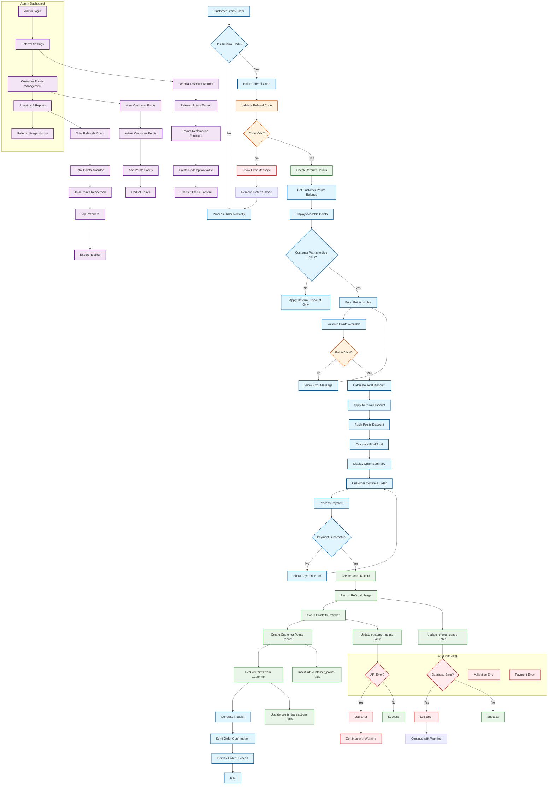

# Referral System Flowchart

## Flowchart Description

### 1. **Customer Journey**
- **Order Initiation**: Customer starts the ordering process
- **Referral Code Entry**: Option to enter referral code for discounts
- **Points Usage**: Option to use accumulated points for additional discounts
- **Order Confirmation**: Final order review and payment processing

### 2. **Validation Processes**
- **Referral Code Validation**: Checks if the referral code exists and is valid
- **Points Validation**: Ensures customer has sufficient points balance
- **Payment Validation**: Verifies payment processing success

### 3. **Backend Processing**
- **Referral Usage Recording**: Tracks when referral codes are used
- **Points Management**: Awards points to referrers and deducts from users
- **Database Updates**: Maintains all referral and points transactions
- **Error Handling**: Manages database and API errors gracefully

### 4. **Admin Management**
- **Settings Configuration**: Admin can configure referral parameters
- **Customer Points Management**: View and adjust customer point balances
- **Analytics & Reporting**: Track referral performance and generate reports

### 5. **Database Operations**
- **referral_usage table**: Records referral code usage
- **customer_points table**: Tracks customer point balances
- **points_transactions table**: Logs all point transactions
- **referral_settings table**: Stores system configuration

## Key Components

### Frontend Components
- **Referral Input Form**: Code validation and error display
- **Points Redemption UI**: Balance display and usage interface
- **Order Summary**: Shows applied discounts and final totals
- **Admin Dashboard**: Settings and management interfaces

### Backend Services
- **Referral Validation API**: Code validation logic
- **Points Management API**: Balance queries and updates
- **Order Processing**: Integration with existing order system
- **Analytics API**: Data aggregation for reports

### Database Schema
- **Customers**: Basic customer information
- **Referral Usage**: Tracking referral code applications
- **Customer Points**: Point balance management
- **Points Transactions**: Transaction history
- **Referral Settings**: System configuration

## Error Handling Strategies

1. **Invalid Referral Codes**: Clear error messages with suggestions
2. **Insufficient Points**: Real-time validation with helpful feedback
3. **Database Errors**: Graceful degradation with logging
4. **Payment Failures**: Retry mechanisms and error recovery
5. **API Failures**: Fallback behaviors and user notifications

## Security Considerations

1. **Referral Code Generation**: Unique, non-guessable codes
2. **Points Validation**: Server-side verification
3. **Transaction Integrity**: Atomic operations for points updates
4. **Rate Limiting**: Prevent abuse of referral system
5. **Audit Trail**: Complete logging of all transactions

## Performance Optimizations

1. **Caching**: Points balance and referral validation results
2. **Database Indexing**: Optimized queries for referral and points data
3. **Batch Processing**: Efficient handling of multiple transactions
4. **Async Operations**: Non-blocking points processing
5. **Background Jobs**: Periodic maintenance and cleanup tasks